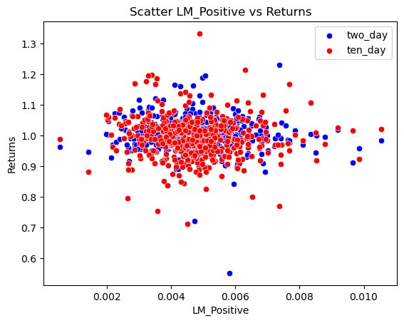
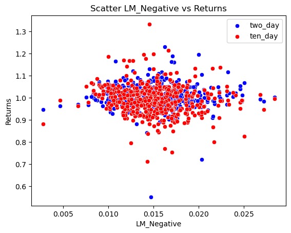
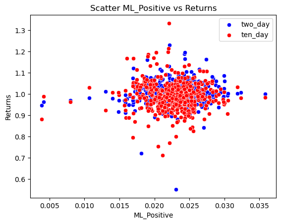
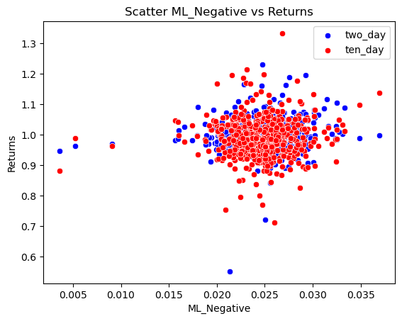
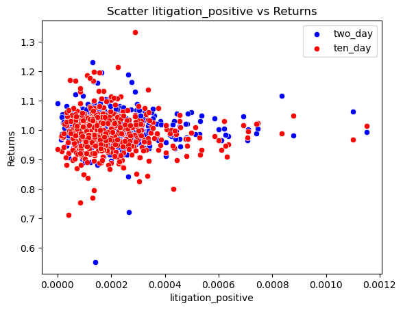
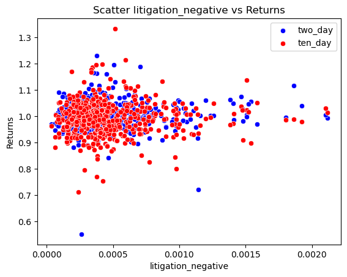
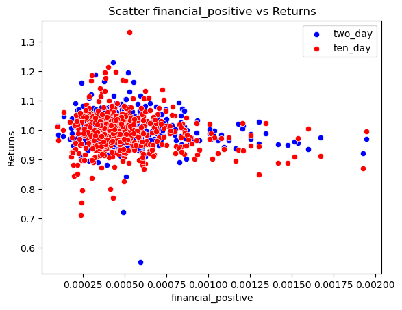
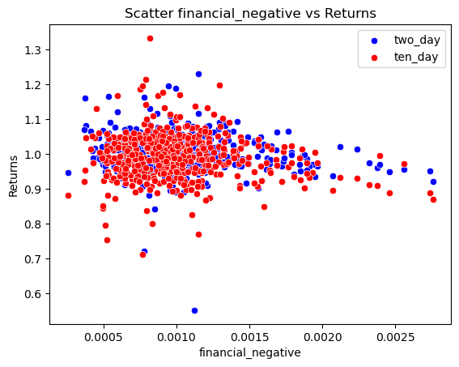
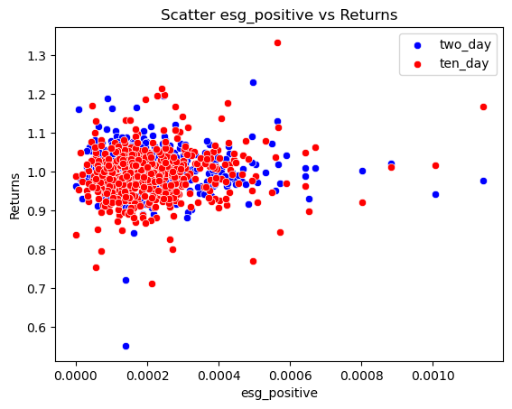
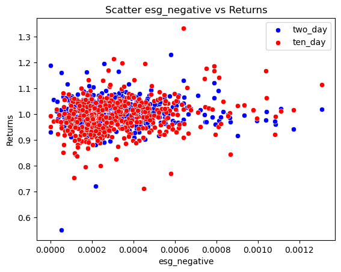

```python
import pandas as pd
import statsmodels.api as sm
import matplotlib.pyplot as plt
import seaborn as sns
from sklearn.linear_model import LinearRegression
```

# Determining Relationships between Sentiment Scores of 10-Ks and Stock Returns

This study analyzes the relationship between textual sentiment extracted from annual reports (10-K filings) of S&P 500 companies in 2022 and subsequent stock returns. Leveraging machine learning and lexicon-based approaches, we quantify the sentiment expressed in these reports using specialized word lists for positive and negative sentiments, with a focus on three domains: litigation, finance, and environmental, social, and governance (ESG) factors. By examining the association between textual sentiment and stock returns, our research sheds light on how linguistic cues embedded within 10-K filings may influence market reactions and investor sentiment.

## Data

The sample of chosen firms is the S&P500. These firms are chosen by a committee and must adhere to the following criteria:
- Market Capitalization of greater than $15.8 Billion
- Annual dollar value traded to float-adjusted market capitalization is greater than 0.75.
- Minimum trading volume of 250,000 per month for six months
- Must be listed on NYSE or NASDAQ
- Primarily based on U.S. Exchange with at least 50% of revenue in U.S.
<br>
The final Dataframe contains 492 rows as some firms were excluded due to not having returns in `crsp_2022_only.dta` on the filing date
<br>

**The final Dataframe contains 18 variables:**
- CIK - A unique numerical identifier assigned to each firm by the SEC
- date - the filing date of the firm's 10-K in 2022
- ticker - the trading ticker of the firm
- ret - the return on the day of the filing date
- two_day - the return from t<sub>0</sub> - t<sub>2</sub> (inclusive)
- ten_day - the return from t<sub>3</sub> - t<sub>10</sub> (inclusive)
- LM_Positive - decimal value of how many positive words from LM_Master dictionary appear in the 10-K
- LM_Negative - decimal value of how many negative words from LM_Master dictionary appear in the 10-K
- ML_Positive - decimal value of how many positive words from ML_positive_unigram appear in the 10-K
- ML_Negative - decimal value of how many negative words from ML_negative_unigram appear in the 10-K
- litigation_positive - positive sentiment near litigation words in 10-K
- litigation_negative - negative sentiment near litigation words in 10-K
- financial_positive - positive sentiment near financial words in 10-K
- financial_negative - negative sentiment near financial words in 10-K
- esg_positive - positive sentiment near esg words in 10-K
- esg_negative - negative sentiment near esg words in 10-K
- word_count - total word count of 10-K
- unique_words - unique words in 10-K

### Determining return variables

The returns for each firm can be found in `crsp_2022_only.dta`
- In order to create the `'ret'` variable the code first takes `crsp_2022_only.dta` and merges it with the dataframe of sp500 stocks with CIKs so that we have a dataframe (`crspCikData`) that contains returns of each firm along with the CIK identifier associated with each firm.
- Next look at our `10k_files.zip` which contains 10-K filings for each firm and grab the list of names of each folder and file inside of it.
- We create a dataframe (`file_list`) using this information that contains CIK and the accession numbers of the filing
- Using a spider we then access each webpage associated with the CIK and accession numbers to pull the filing date and then add that to our previous dataframe (`file_list`)
- We then drop all columns from `file_list` besides CIK and date and then merge `file_list` with `crspCikData` on `['CIK', 'date']` with an inner merge.
- This gives us a dataframe `returns10k` that contains the CIK, filing date, return on that filing date, and ticker of the firm
- This process naturally excludes any firms that do not have returns on the filing date as they will not be useful to our analysis

**Calculating two_day and ten_day**
<br>
- We next need to calculate returns from t<sub>0</sub> - t<sub>2</sub> and t<sub>3</sub> - t<sub>10</sub>
- First we create a loop that goes through each CIK in `returns10k`
- We then query for entries in `crspCikData` that are equal to the current CIK
- We also check for the filing date on the current CIK in `returns10k`
- Finally we find the index of the observation for our current CIK that matches the filing date using `start_date_index = current_firm[current_firm["date"] == start_date].index[0]`
- We then create three more variables for ease of use, `plus_two_index`, `plus_three_index`, `plus_ten_index` which are equal to `start_date_index` plus two, three, and ten respectively
  - We make use of `calculate_cumulative_returns` which creates a `cumulative_returns` column with the formula `cumulative_returns = (1 + df[ret_column]).cumprod()`
- Next we take a slice of our initial query using `current_firm.loc[start_date_index:plus_two_index]` and then grab the last entry using .loc[plus_two_index] to calculate cumulative return from t<sub>0</sub> - t<sub>2</sub>
- We repeat this for t<sub>3</sub> - t<sub>10</sub> using the same methodology
- After grabbing these values we add them to our `returns10k` dataframe using `returns10k.at[row.name, "two_day"]` which adds the number at the correct CIK


### Building sentiment variables

In order to build the sentiment variables we use `LM_MasterDictionary_1993-2021.csv`, `ML_negative_unigram.txt`, `ML_positive_unigram.txt` and lists of words associated with litigation, finance, and ESG that can be found in `build_sample.ipynb` along with html files of each 10K found in `10k_files/10k_files.zip`

- We first need to be able to unzip the files using `ZipFiles('10k_files/10k_files.zip')`
- We then loop through each file using `for cik in tqdm(returns10k["CIK"])` - note that tqdm gives us a useful progress bar
- After building the loop, for each html file we first need to read the file into a useable format with `report_file.read().decode(encoding="utf-8")`
- Next we use BeautifulSoup to clean the file into text with
  - `soup = BeautifulSoup(html, "lxml-xml")` 
  - ```
    for div in soup.find_all("div", {"style": "display:none"}):
      div.decompose()
    ```
  - gets rid of html tags leaving plain text
  - `soup = re.sub(r"\W", " ", soup)` - deletes punctuation
  - `soup = re.sub(r"\s+", " ", soup)` - deletes white spaces
  - `soup_list = soup.split(" ")` - creates list of all words
  - `word_count = len(soup_list)` - finds total number of words in document so we can determine what percent of them are positive/negative
<br>

**Creating lm_positive and lm_negative**
- we first read the csv into a pandas dataframe using `lm_masterdictionary = pd.read_csv("inputs/LM_MasterDictionary_1993-2021.csv")`
- next we pull the positive words by using `lm_positive = lm_masterdictionary[lm_masterdictionary["Positive"] > 0]["Word"].to_list()`
  - The process is the same for negative words
  - `lm_positive = [elem.lower() for elem in lm_positive]` we then make each word in the final list lower case for matching purposes
  - finally we use `sum(soup_list.count(elem) for elem in lm_positive) / word_count` to check for the percent a word in `lm_positive` or `lm_negative` appears in our `soup_list` from 10-Ks
<br>

**Creating ml_positive and ml_negative**
- we can read text files the same way we read a csv into a pandas dataframe `ml_positive = pd.read_csv("inputs/ML_positive_unigram.txt", header=None)[0].tolist()`
  - Note that the words are already all lower case so no need to do the same
  - We can determine the percent appearance in the same manner as `lm_positive` and `lm_negative`
<br>

**Creating litigation_positive, litigation_negative, financial_positive, financial_negative, esg_positive, esg_negative**
- we first begin with our generated list of words/phrases related to each topic
- Using `litigation_related_words` as our example
  - We needed to create a regex of `litigation_related_words` when they're near words in `ml_positive` and `ml_negative` but lists aren't compatible with the function
  - `NEAR_regex()` needs lists of words in a `str` like (Litigation|Lawsuit|Legal action)
  - So we use
  - ```
    def list_to_near_regex(list):
      separator = "|"
      return "(" + separator.join(list).lower() + ")"
    ```
  - In order to convert lists into a compatible format, giving us `lm_positive_regex` and `litigation_near_regex`
  - We can then NEAR_regex(`[litigation_near_regex, ml_positive_regex]`,partial=True) to create a regex that searches for instances where words from the two lists appear within 5 words of each other and allowing partial matches
  - Partial matches were chosen to allow for plural/non plural versions of words and 5 words were chosen because sometimes 10-Ks can use complicated dense legal language
- Now that we have our NEAR_regex `positive_litigation`
  - we can use `len(re.findall(negative_esg, soup))` to determine number of hits in our html for each firm and then divide that by `word_count` to determine percentage of hits relative to the length of the document


### Dictionary information

- We can also discover some information about the number of words in each dictionary


```python
lm_masterdictionary = pd.read_csv("inputs/LM_MasterDictionary_1993-2021.csv")

lm_positive = lm_masterdictionary[lm_masterdictionary["Positive"] > 0]["Word"].to_list()
lm_positive = [elem.lower() for elem in lm_positive]
print(f"There are {len(lm_positive)} words in lm_positive")

lm_negative = lm_masterdictionary[lm_masterdictionary["Negative"] > 0]["Word"].to_list()
lm_negative = [elem.lower() for elem in lm_negative]
print(f"There are {len(lm_negative)} words in lm_negative")

ml_positive = pd.read_csv("inputs/ML_positive_unigram.txt", header=None)[0].tolist()
print(f"There are {len(ml_positive)} words in ml_positive")
ml_negative = pd.read_csv("inputs/ML_negative_unigram.txt", header=None)[0].tolist()
print(f"There are {len(ml_positive)} words in ml_negative")
```

    There are 347 words in lm_positive
    There are 2345 words in lm_negative
    There are 75 words in ml_positive
    There are 75 words in ml_negative
    

### Chosen Topics

The three topics chosen for discussion were litigation, financial, and ESG. I believeed that they provided a wide variety of information and challenges that firms may face.

- Financial language allows us to determine if positive or negative language surrounding financial terms gives the markets good information for making decisions around the performance of a firm
- Litigation related topics allow us to see how legal challenges or opportunities might affect the market's perception of a firm
- ESG related topics allow us to see how positive and negative mentions of topics like sustainability affect the performance of a firm
- I believe these three dimensions have little overlap allowing us to see which of them might have a major impact on a firm's future stock price

### Correlations and Stuff


```python
analysis_sample = pd.read_csv('outputs/analysis_sample.csv')
analysis_sample = analysis_sample.drop(columns='Unnamed: 0')
analysis_sample['ret'] = analysis_sample['ret']+1
```


```python
variable_returns = ['ret','two_day','ten_day']
variable_sentiment = ['LM_Positive', 'LM_Negative', 'ML_Positive','ML_Negative','litigation_positive','litigation_negative','financial_positive','financial_negative','esg_positive','esg_negative']

correlations = {}

for dependent_var in variable_returns:
    correlations[dependent_var] = {}
    
    # Loop through independent variables
    for independent_var in variable_sentiment:
        # Perform OLS regression and get R-squared value
        rsquared = sm.OLS.from_formula(f'{dependent_var} ~ {independent_var}',
                                       data=analysis_sample).fit().rsquared
        correlations[dependent_var][independent_var] = rsquared

# Convert dictionary to DataFrame
correlations_df = pd.DataFrame(correlations)
```


```python
# correlations between the returns and the sentiment analysis
correlations_df
```


<div>
<style scoped>
    .dataframe tbody tr th:only-of-type {
        vertical-align: middle;
    }

    .dataframe tbody tr th {
        vertical-align: top;
    }

    .dataframe thead th {
        text-align: right;
    }
</style>
<table border="1" class="dataframe">
  <thead>
    <tr style="text-align: right;">
      <th></th>
      <th>ret</th>
      <th>two_day</th>
      <th>ten_day</th>
    </tr>
  </thead>
  <tbody>
    <tr>
      <th>LM_Positive</th>
      <td>0.007816</td>
      <td>0.006418</td>
      <td>0.001643</td>
    </tr>
    <tr>
      <th>LM_Negative</th>
      <td>0.000169</td>
      <td>0.000002</td>
      <td>0.014125</td>
    </tr>
    <tr>
      <th>ML_Positive</th>
      <td>0.000851</td>
      <td>0.003927</td>
      <td>0.001965</td>
    </tr>
    <tr>
      <th>ML_Negative</th>
      <td>0.001611</td>
      <td>0.011122</td>
      <td>0.001950</td>
    </tr>
    <tr>
      <th>litigation_positive</th>
      <td>0.000016</td>
      <td>0.000357</td>
      <td>0.001930</td>
    </tr>
    <tr>
      <th>litigation_negative</th>
      <td>0.000746</td>
      <td>0.002149</td>
      <td>0.000827</td>
    </tr>
    <tr>
      <th>financial_positive</th>
      <td>0.001817</td>
      <td>0.021139</td>
      <td>0.016222</td>
    </tr>
    <tr>
      <th>financial_negative</th>
      <td>0.000912</td>
      <td>0.017072</td>
      <td>0.009877</td>
    </tr>
    <tr>
      <th>esg_positive</th>
      <td>0.000719</td>
      <td>0.000352</td>
      <td>0.014895</td>
    </tr>
    <tr>
      <th>esg_negative</th>
      <td>0.000176</td>
      <td>0.002676</td>
      <td>0.053098</td>
    </tr>
  </tbody>
</table>
</div>


```python
sns.scatterplot(data=analysis_sample, x='LM_Positive', y='two_day', color='blue', label='two_day')
sns.scatterplot(data=analysis_sample, x='LM_Positive', y='ten_day', color='red', label='ten_day')

plt.xlabel('LM_Positive')
plt.ylabel('Returns')
plt.title('Scatter LM_Positive vs Returns')

plt.legend()
plt.show()
```


    

    


```python
sns.scatterplot(data=analysis_sample, x='LM_Negative', y='two_day', color='blue', label='two_day')
sns.scatterplot(data=analysis_sample, x='LM_Negative', y='ten_day', color='red', label='ten_day')

plt.xlabel('LM_Negative')
plt.ylabel('Returns')
plt.title('Scatter LM_Negative vs Returns')

plt.legend()
plt.show()
```


    

    


```python
sns.scatterplot(data=analysis_sample, x='ML_Positive', y='two_day', color='blue', label='two_day')
sns.scatterplot(data=analysis_sample, x='ML_Positive', y='ten_day', color='red', label='ten_day')

plt.xlabel('ML_Positive')
plt.ylabel('Returns')
plt.title('Scatter ML_Positive vs Returns')

plt.legend()
plt.show()
```


    

    


```python
sns.scatterplot(data=analysis_sample, x='ML_Negative', y='two_day', color='blue', label='two_day')
sns.scatterplot(data=analysis_sample, x='ML_Negative', y='ten_day', color='red', label='ten_day')

plt.xlabel('ML_Negative')
plt.ylabel('Returns')
plt.title('Scatter ML_Negative vs Returns')

plt.legend()
plt.show()
```


    

    


```python
sns.scatterplot(data=analysis_sample, x='litigation_positive', y='two_day', color='blue', label='two_day')
sns.scatterplot(data=analysis_sample, x='litigation_positive', y='ten_day', color='red', label='ten_day')

plt.xlabel('litigation_positive')
plt.ylabel('Returns')
plt.title('Scatter litigation_positive vs Returns')

plt.legend()
plt.show()
```


    

    


```python
sns.scatterplot(data=analysis_sample, x='litigation_negative', y='two_day', color='blue', label='two_day')
sns.scatterplot(data=analysis_sample, x='litigation_negative', y='ten_day', color='red', label='ten_day')

plt.xlabel('litigation_negative')
plt.ylabel('Returns')
plt.title('Scatter litigation_negative vs Returns')

plt.legend()
plt.show()
```


    

    


```python
sns.scatterplot(data=analysis_sample, x='financial_positive', y='two_day', color='blue', label='two_day')
sns.scatterplot(data=analysis_sample, x='financial_positive', y='ten_day', color='red', label='ten_day')

plt.xlabel('financial_positive')
plt.ylabel('Returns')
plt.title('Scatter financial_positive vs Returns')

plt.legend()
plt.show()
```


    

    


```python
sns.scatterplot(data=analysis_sample, x='financial_negative', y='two_day', color='blue', label='two_day')
sns.scatterplot(data=analysis_sample, x='financial_negative', y='ten_day', color='red', label='ten_day')

plt.xlabel('financial_negative')
plt.ylabel('Returns')
plt.title('Scatter financial_negative vs Returns')

plt.legend()
plt.show()
```


    

    


```python
sns.scatterplot(data=analysis_sample, x='esg_positive', y='two_day', color='blue', label='two_day')
sns.scatterplot(data=analysis_sample, x='esg_positive', y='ten_day', color='red', label='ten_day')

plt.xlabel('esg_positive')
plt.ylabel('Returns')
plt.title('Scatter esg_positive vs Returns')

plt.legend()
plt.show()
```


    

    


```python
sns.scatterplot(data=analysis_sample, x='esg_negative', y='two_day', color='blue', label='two_day')
sns.scatterplot(data=analysis_sample, x='esg_negative', y='ten_day', color='red', label='ten_day')

plt.xlabel('esg_negative')
plt.ylabel('Returns')
plt.title('Scatter esg_negative vs Returns')

plt.legend()
plt.show()
```


    

    


As we can see in the corerlation table above it seems as though LM_Positive is more strongly correlated with ret than LM_negative, however the opposite seems to be true with ML_Positive and ML_Negative. Additionally negative litigation sentiment seems to matter more while litigation_positive is extremely low comparatively. Financial_positive and esg_positive seem more correlated with ret than their negative couterparts
<br>

For two_day and ten_day, magnitude of correlation seems to go down generally as time moves on except in the cast of esg scores, LM_negative, ML_Negative. This could indicate that optimism from 10_Ks wanes over time while negative reports are given more time to saturate the market

As a note there are only 492 firms in the final dataset as firms without a filing date on the release of their 10-K were excluded

## **Further Analysis**

If I had more time I would
- Look at 2021 accounting data in order to break down firms by industry using gsector from `2021_ccm_cleaned.dta`
  - Determine if firms in certain industries were affected by these contextual sentiment scores on a greater scale
  - As an example do firms in the energy sector have a higher correlation with ESG sentiment scores?
  - Are firms in the financial sector affected by financial sentiment to a greater degree because that is their direct business or to a lesser degree because there is too much white noise
  - Determine if negative or positive textual sentiment is affects firms in different sectors to a greater degree
- I would also make better plots
